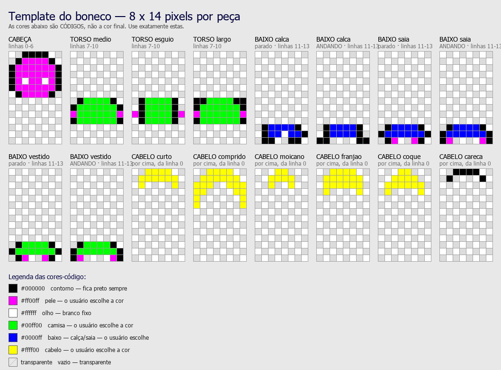

# projeto sem nome

Uma sala na internet pra assistir e ouvir coisas junto com os amigos, com
bonequinho andando pela tela e cara de Windows 98.

A ideia vem das antigas salas de música do Transformice e do MSN: o que
prendia não era o player de música, era **estar num lugar** — ver os
bonequinhos dos outros na tela, reconhecer quem sempre aparecia, a sala ter
nome e história.

Sites de assistir junto existem (Watch2Gether, Teleparty, Kosmi) e são bons.
Mas todos tratam a sala como link descartável: cria, manda, acaba. A aposta
aqui é o contrário — sala fixa, gente recorrente, identidade visual própria.

> **Status:** em construção. A sala, o chat, as contas e o editor de avatar
> funcionam. A sincronia de vídeo e o compartilhamento de tela ainda não.
>
> O caminho completo até o MVP, com as decisões e o porquê de cada uma, está
> em **[docs/PLANO.md](docs/PLANO.md)**.

<p align="center">
  
</p>

---

## O que funciona hoje

- **Conta com senha** — apelido, senha, e o boneco preso à conta
- **Sala em tempo real** — entra pelo nome; quem digita o mesmo nome cai junto
- **Bonequinho que anda** — setas, WASD ou clique no chão, com quem está na
  frente cobrindo quem está atrás
- **Chat** com balão de fala sobre a cabeça
- **Editor de avatar** em três abas: peças com cores livres, desenho pixel a
  pixel, e um guarda-roupa de looks salvos

## O que ainda não

- Sincronia de vídeo do YouTube (é a próxima etapa, e a mais difícil)
- Compartilhamento de tela por WebRTC
- Histórico da sala — a sala some quando o servidor reinicia; as contas não

---

## Decisões que valem explicar

**O boneco anda na hora, sem esperar o servidor.**
O servidor só conta aos outros onde você está. Esperar a confirmação pra
desenhar deixaria o movimento borrachudo em qualquer internet que não fosse
ótima — e movimento borrachudo mataria justamente a parte que dá graça.

**Quem você é vem do cookie, não do que o cliente diz ser.**
O WebSocket lê a sessão e usa o apelido e o avatar do banco. Não existe
mensagem de "join" carregando nome — se existisse, qualquer um entraria na
sala se dizendo outra pessoa.

**Senha por scrypt, nunca em texto.**
O custo é calibrado pra ser imperceptível num login e caro em ataque de
força bruta. Login errado devolve sempre a mesma mensagem *e demora o mesmo
tempo* mesmo quando o apelido não existe — senão dá pra descobrir quem tem
conta só cronometrando a resposta.

**O avatar não é imagem, é código.**
São cinco cores mais três índices de forma, ou — no modo desenho — 112
dígitos hexadecimais apontando pra uma paleta de até 15 cores. O avatar
inteiro cabe em menos de 200 bytes, então trocar de boneco no meio da sala
não pesa em nada, e não existe upload (nem o custo de moderar upload).

**O canvas do boneco tem uma linha a mais que o sprite.**
Ao andar, o boneco sobe um pixel. Sem essa folga o topo da cabeça era
desenhado fora do canvas e sumia — bug real, encontrado testando.

**Frontend sem framework.**
A estética Win98 é feita de bordas chanfradas, gradientes e fontes de
sistema. CSS puro faz isso melhor e mais rápido do que lutar contra uma
biblioteca de componentes, e o projeto tem três telas.

---

## Stack

| | |
|---|---|
| Backend | Python, FastAPI, WebSocket |
| Validação | Pydantic — tudo que entra pelo socket passa por schema |
| Banco | SQLite |
| Frontend | HTML, CSS e JavaScript puros (ES modules, Canvas) |
| Deploy | Fly.io (Docker) |

---

## Rodar

```powershell
git clone https://github.com/joaoromaodev/projeto-sem-nome.git
cd projeto-sem-nome
.\run.ps1
```

Abre em <http://localhost:8000>. A primeira execução instala as dependências.
Em Linux/macOS: `pip install -r requirements.txt && uvicorn app.main:app`.

Pra testar com duas pessoas na mesma máquina, use uma janela anônima ao lado
da normal — duas abas normais compartilham o mesmo login.

### Chamar gente de fora, sem deploy

```powershell
winget install --id Cloudflare.cloudflared
.\run.ps1 -Tunel
```

O endereço público aparece na janela do túnel. Muda a cada reinício e só
funciona com a máquina ligada.

### Botar no ar

```powershell
fly launch --no-deploy
fly volumes create dados --size 1 --region gru
fly deploy
```

O `fly.toml` já vem com volume em `/data` (sem ele, todo deploy apagaria as
contas), região São Paulo, e uma máquina só — o estado da sala vive em
memória, então dois usuários em máquinas diferentes não se enxergariam.

Vercel não serve: é serverless e não segura conexão WebSocket aberta.

---

## Organização

```
app/
  protocol.py   formato das mensagens do WebSocket (Pydantic)
  db.py         SQLite: contas, senhas, sessões e guarda-roupa
  rooms.py      salas e quem está dentro — em memória
  main.py       rotas HTTP, conta e o WebSocket
static/
  entrar.html   login e cadastro
  index.html    montar o boneco e escolher a sala
  sala.html     a sala
  js/avatar.js  desenha o boneco
  js/editor.js  painel do boneco: peças, pixel a pixel e guarda-roupa
  js/api.js     conversa com o servidor
  js/sala.js    conexão, movimento e chat
  css/y2k.css   a cara Win98
ferramentas/    exportar, ler e validar sprites
template/       o template do boneco e as regras pra editar
docs/           a apresentação usada pra validar a ideia
```

## Mexer na arte do boneco

```powershell
python ferramentas/gerar_template.py     # exporta o template como PNG
# ... edita template/boneco-template.png em Aseprite/Piskel/Paint ...
python ferramentas/ler_template.py       # confere e imprime o código novo
```

O template usa **cores-código** (magenta = pele, verde = camisa…) em vez das
cores finais. É isso que permite o mesmo desenho servir pra qualquer
combinação que o usuário escolher. As regras estão em
[template/COMO-EDITAR.md](template/COMO-EDITAR.md).

O `ler_template.py` aponta pixel por pixel se alguma cor saiu fora da paleta
— o caso comum é o editor ter deixado a suavização ligada.

---

## Limitações conhecidas

- Estado da sala em memória: reiniciou, esvaziou
- Máximo 12 pessoas por sala (`MAX_POR_SALA` em `app/rooms.py`)
- Sem recuperação de senha
- **Sem moderação de desenho.** O editor pixel a pixel é livre, então dá pra
  desenhar qualquer coisa. Entre amigos tudo bem; numa sala aberta a
  desconhecidos isso precisaria de resposta antes
- Qualquer um logado entra em qualquer sala se souber o nome
